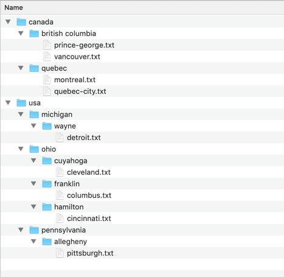

# Introduction to Tools

Welcome to Tech Elevator! This is the first of many exercises you will complete throughout the cohort. The intent of the exercises is to reinforce the concepts you learn every day and to provide you with the opportunity to practice your new skills.

The Introduction to Tools exercise covers Git and several Unix commands typically used alongside Git. This exercise is intended to help you gain familiarity and confidence in working with the command line inside the Terminal.

## Learning Objectives

After completing this exercise, students will understand:

- How to navigate the directory structure.
- How to identify the directory they are currently in.
- How to display files within a directory.
- How to rename, copy, and remove files and directories.
- Common techniques used when working with Git.
- How to push work to Git for review.
- How to use the README file to complete exercises.

## Evaluation Criteria & Functional Requirements

- The `verify.sh` file prints `✅ Everything Works Perfectly!` to the screen when run from the command line using `sh verify.sh`
- Directories and files that have been modified, added, removed, moved, or renamed reflect the work that was completed during the execution of the 'script.sh' file.
- All of the questions not marked as optional have been answered. This should be completed for all exercises you work on throughout the cohort.
- The appropriate commits have been added to Git.

## Tips and Tricks

- When working through exercises at Tech Elevator, you should refer to the README.md files found at the root of each exercise folder for clarification on what is expected for each exercise, the work that needs to be completed, and information related to the concepts you should learn in each exercise. There is also a section that includes helpful tips, tricks, and additional links that might be of value to dig deeper into the concepts discussed for each exercise. **Be sure to make use of the README file as you work through each exercise.**
- Make sure you save the script (ctrl+s / cmd+s) before you try and run it.
- Refererence Finder (Mac) or Explorer (PC) for a visual of directory structure created by your script.

## Instructions

### Step One: Make a script file using Bash commands

- Open a Terminal (Mac) or Git Bash (PC) window.
- Navigate to the folder containing today's exercise.
- In the terminal window, run the `verify.sh` script by using the command `sh verify.sh`. 
    - **Note**: This command will be used to receive feedback if you've completed the exercise successfully. Initially, you should see the following output:

    ```
    ---- RUNNING SCRIPT ----

    ---- VERIFYING SCRIPT ----
    ❗️ The folder for /usa does not exist
    ❗️ The folder for /canada does not exist

    You need to make a few more changes still.
    Make sure you created everything in the correct location
    and that they are spelled correctly.
    ```
- 
- Open the `script.sh` file in the VS Code editor by typing `code script.sh`. 
    - **Note**: You should see the VS Code window open the file `script.sh` if it worked correctly.
- In the editor window for `script.sh`, add the commands necessary under each commented line.
- After making changes to `script.sh` (and saving them), run the script using `sh script.sh`.
- Continually to manually verify the changes to your file system after you run each script by checking Finder/Explorer.
- When you think you have addressed all the comments, rerun `verify.sh` to see if the script works.
- When your script is working, you will see `✅ Everything Works Perfectly!`

This is what the final folder and file structure should look like when you have completed the exercise.




### Step Two: Upload your code to BitBucket using Git commands

In the terminal window type the following commands:

```
$ git status
$ git add -A
$ git commit -m "Submitting Week 1 Day 1 exercise"
$ git push origin master
```